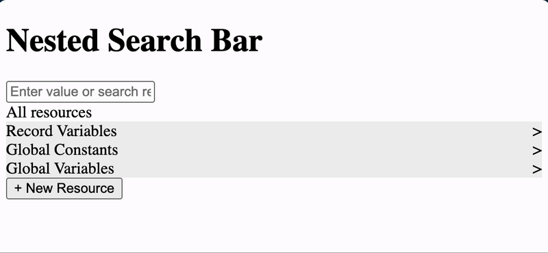
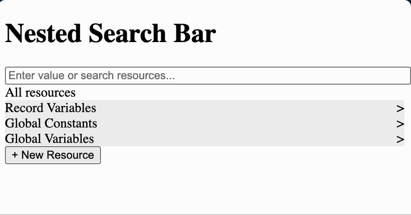

# 🔍 Nested Search Bar

A modern, interactive React application that provides a hierarchical search experience with breadcrumb navigation and dynamic path generation.

## ✨ Features

- **Hierarchical Search**: Navigate through nested data structures with ease
- **Breadcrumb Navigation**: Visual path tracking with clickable navigation
- **Dynamic Path Generation**: Automatic generation of camelCase paths as you navigate
- **Interactive UI**: Hover effects and smooth transitions
- **Resource Management**: Support for different data types (resources, endpoints, constants)
- **Real-time Search**: Instant filtering and navigation

## 🎯 Demo

### Draft 1 - Basic Navigation



### Draft 2 - Advanced Features



## 🚀 Getting Started

### Prerequisites

- Node.js (version 16 or higher)
- npm or yarn package manager

### Installation

1. **Clone the repository**

   ```bash
   git clone <repository-url>
   cd nested-search-bar
   ```

2. **Install dependencies**

   ```bash
   npm install
   ```

3. **Start the development server**

   ```bash
   npm run dev
   ```

4. **Open your browser**
   Navigate to `http://localhost:5173` to see the application in action.

## 🛠️ Available Scripts

- `npm run dev` - Start development server
- `npm run build` - Build for production
- `npm run lint` - Run ESLint
- `npm run preview` - Preview production build

## 📁 Project Structure

```
nested-search-bar/
├── src/
│   ├── App.jsx          # Main application component
│   ├── App.css          # Application styles
│   ├── main.jsx         # Application entry point
│   └── mocks/
│       └── searchData.js # Sample hierarchical data
├── public/              # Static assets
├── gif/                 # Demo GIFs
└── package.json         # Project dependencies
```

## 🎮 How to Use

1. **Start at the Root Level**: The application begins with "All resources" showing top-level categories
2. **Navigate Resources**: Click on any resource item (marked with ">") to drill down
3. **Follow Breadcrumbs**: Use the breadcrumb navigation to jump back to any previous level
4. **View Generated Paths**: The search input automatically updates with the current navigation path
5. **Add New Resources**: Use the "+ New Resource" button to add items (feature in development)

## 📊 Data Structure

The application uses a hierarchical data structure with the following types:

- **Resource**: Container items that can have children
- **Endpoint**: Leaf nodes representing specific data points
- **Global Constants**: System-wide constant values

Example structure:

```javascript
{
  id: 1,
  type: "resource",
  value: "Record Variables",
  children: [
    {
      id: 11,
      type: "resource",
      value: "Account",
      children: [
        {
          id: 111,
          type: "endpoint",
          value: "Account ID"
        }
      ]
    }
  ]
}
```

## 🎨 Styling

The application features a clean, modern design with:

- Subtle hover effects
- Clear visual hierarchy
- Responsive layout
- Intuitive navigation indicators

## 🔧 Customization

### Adding New Data

Edit `src/mocks/searchData.js` to add your own hierarchical data structure.

### Styling Modifications

Modify `src/App.css` to customize the appearance and behavior.

## 🚧 Future Enhancements

- [ ] Search functionality with real-time filtering
- [ ] Drag and drop for reordering
- [ ] Export/import data functionality
- [ ] Keyboard navigation support
- [ ] Dark mode theme
- [ ] Mobile responsive design

## 🤝 Contributing

1. Fork the repository
2. Create a feature branch (`git checkout -b feature/amazing-feature`)
3. Commit your changes (`git commit -m 'Add some amazing feature'`)
4. Push to the branch (`git push origin feature/amazing-feature`)
5. Open a Pull Request

## 📝 License

This project is licensed under the MIT License - see the [LICENSE](LICENSE) file for details.

## 👨‍💻 Author

**Neerja Nigam**

---

⭐ **Star this repository if you found it helpful!**
